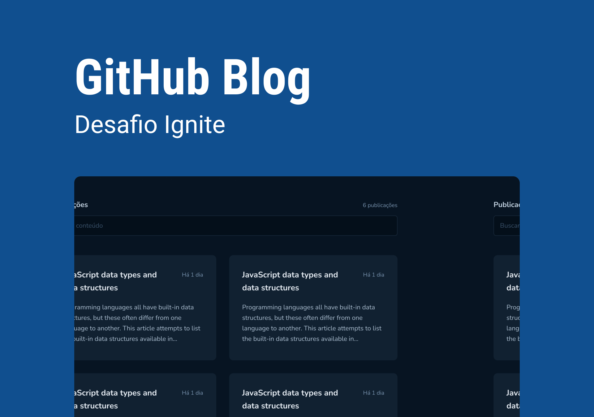

<p align="center">
  
</p>

<p align="center">
  
</p>

<br>

## 🧪 Tecnologias

Esse projeto foi desenvolvido com as seguintes tecnologias:

- [NPM](https://www.npmjs.com/)
- [React](https://reactjs.org)
- [Vite](https://vitejs.dev/)
- [TypeScript](https://www.typescriptlang.org/)
- [React Query](https://tanstack.com/query/latest/)

## 🚀 Como executar

Clone o projeto e acesse a pasta do mesmo.

```bash
$ git clone https://github.com/CesarNeo/github-blog.git
$ cd github-blog
```

Para iniciá-lo, siga os passos abaixo:
```bash
# Instalar as dependências
$ npm install

# Iniciar o projeto
$ npm run dev
```
O app estará disponível no seu browser pelo endereço http://localhost:5173.

## 💻 Projeto

Uma aplicação que utilizará da API do GitHub para buscar issues de um repositório, dados do meu perfil e exibir elas como um blog.

- Listagem do meu perfil com imagem, número de seguidores, nome e outras informações disponíveis pela API do GitHub.
- Listar e filtrar todas as issues do repositório com um pequeno resumo do conteúdo dela
- Criar uma página para exibir um post (issue) completo

Feito com 💜 by Cesar Emmanuel 👋🏻
